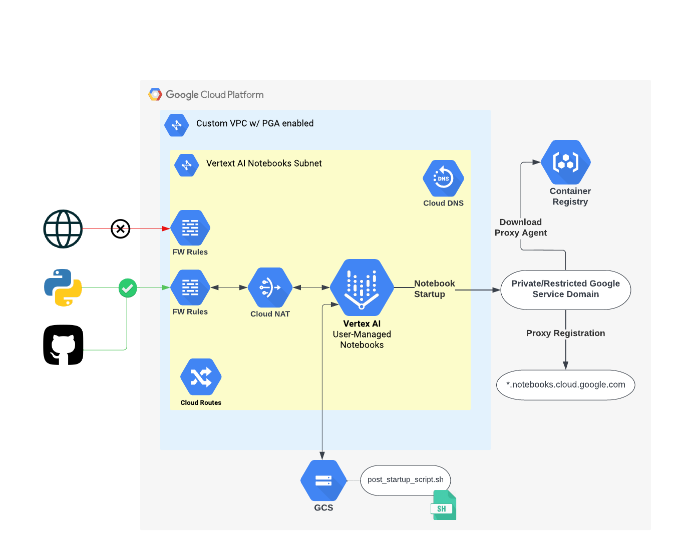

# Terraform Private Vertex AI Workbench User-Managed Notebooks Module

This module deploys [Vertex AI Workbench User-Managed Noteboks](https://cloud.google.com/vertex-ai/docs/workbench/user-managed/introduction) on GCP that are private (interal IP only), while still remaining easily usable and accessible by the user of the notebook.

## Introduction

User-Managed Notebooks on Vertex AI allow users to easily deploy GCE VMs with JupyterLab pre-installed. These VMs, by default, use external IP in order to spin up the instance (by running startup scripts), as well as to actually use the Jupyter notebook, such as installing Python libraries from PyPi or interacting with GitHub.

The problem with this is the security issue that arises with external IP. GCE VM Security best practice states that VMs should not have an external IP assigned to it, unless absolutely necessary, as it opens the instance up to attack from the public internet. Therefore, by default, Vertex AI User-Managed Notebooks are, by default, vulnerable to attach from the public internet too.

This Terraform module is the answer to this problem. The security and networking configuration that the Vertex Notebooks in this module use allows the Notebooks to be deployed with only internal IP (no external IP), while still maintaining the useability and accessibility (ie. can be still accessed directly via the GCP Vertex Workbench GUI by clicking the 'OPEN JUPYTERLAB' button).


## Architecture

The following Notebook/Network Architecture is deployed in this module:





For more information about each component of this design, please refer to [ARCHITECTURE.md](./docs/ARCHITECTURE.md)


## Usage

There is an example of how to use this module in the [example](./example/) folder but simple usage is as follows:

```hcl
module "private_vertex_nb_instances" {
  source                        = "<LINK TO MODULE SOURCE>"
  project                       = var.project
  zone                          = var.zone
  region                        = var.region
  notebooks                     = var.notebooks
  additional_vertex_nb_sa_roles = var.additional_vertex_nb_sa_roles
  vpc_network_name              = var.vpc_network_name
  subnet_ip_cidr_range          = var.subnet_ip_cidr_range
  vpc_sc_enabled                = false
  gcs_bucket_name               = var.gcs_bucket_name
  gcs_labels                    = var.gcs_labels
  additional_fw_rules           = var.additional_fw_rules
}
```

Then perform the following commands on the root folder:

- `terraform init` to get the plugins
- `terraform plan` to see the infrastructure plan
- `terraform apply` to apply the infrastructure build
- `terraform destroy` to destroy the built infrastructure


## Inputs

| Name | Description | Type | Default | Required |
|------|-------------|------|---------|:--------:|
| project | Your GCP Project ID | string | n/a | yes |
| zone | The GCP Zone for Vertex Notebook User-Managed Instances | string | europe-west1-b | no |
| region | The GCP region for the GCS bucket and Artifact Registry | string | europe-west1 | no |
| notebooks | A map containing the containing the configuration for the desired Vertex AI Workbench User-Managed Notebooks | map | {} | yes |
| image_project | GCP Project conataining VM image for the Notebook instances | string | deeplearning-platform-release | no |
| image_family | Image family for the Notebook instances (https://cloud.google.com/compute/docs/images) | string | common-cpu | no |
| machine_type | The Notebook Instance's machine type | string | n1-standard-4 | no |
| boot_disk_type | Boot disk type for notebook instances. Possible values are DISK_TYPE_UNSPECIFIED, PD_STANDARD, PD_SSD and PD_BALANCED | string | PD_STANDARD | no |
| boot_disk_size_gb | The size of the boot disk in GB attached to notebook instances, up to a maximum of 64 TB. The minimum recommended value is 100GB | number | 100 | no |
| data_disk_size_gb | The size of the data disk in GB attached to notebook instances, up to a maximum of 64 TB. You can choose the size of the data disk based on how big your notebooks and data are | number | 100 | no |
| no_remove_data_disk | If true, the data disk will not be auto deleted when deleting the instance | bool | true | no |
| install_gpu_driver | Whether the end user authorizes Google Cloud to install GPU driver on this instance. If this field is empty or set to false, the GPU driver won't be installed. Only applicable to instances with GPUs | string | false | no |
| accelerator_type | Type of accelerator. Possible values are ACCELERATOR_TYPE_UNSPECIFIED, NVIDIA_TESLA_K80, NVIDIA_TESLA_P100, NVIDIA_TESLA_V100, NVIDIA_TESLA_P4, NVIDIA_TESLA_T4, NVIDIA_TESLA_T4_VWS, NVIDIA_TESLA_P100_VWS, NVIDIA_TESLA_P4_VWS, NVIDIA_TESLA_A100, TPU_V2, and TPU_V3 | string | ACCELERATOR_TYPE_UNSPECIFIED | no |
| accelerator_core_count | Count cores of accelerator | number | 1 | no |
| additional_vertex_nb_sa_roles | Additional roles that you may want to assign to the Vertex AI nb SA | list | [] | no |
| vpc_network_name | The name of your VPC Network | string | n/a | yes |
| subnet_ip_cidr_range | The name of your VPC Subnetwork | string | 10.0.0.0/21 | no |
| vpc_sc_enabled | A boolean flag to signal whether this enviornment is inside a VPC SC Perimeter | bool | false | no |
| gcs_bucket_name | Name of the GCS Bucket that will contain the post startup script | string | n/a | yes |
| gcs_labels | Labels to attach to the GCS Bucket. Useful for labelling resources for billing purposes | map(string) | null | no |

## Outputs

| Name | Description |
|------|-------------|
| vpc_id | an identifier for the VPC network with format projects/{{project}}/global/networks/{{name}} |
| vpc_self_link | The URI of the created VPC. |
| subnetwork_id | an identifier for the VPC subnetwork with format projects/{{project}}/regions/{{region}}/subnetworks/{{name}} |
| subnetwork_self_link | The URI of the created subnetwork. |
| private_ip_alloc_id | an identifier for the private ip allocation with format projects/{{project}}/global/addresses/{{name}} |
| private_ip_self_link | The URI of the created IP address. |
| router_id | an identifier for the router with format projects/{{project}}/regions/{{region}}/routers/{{name}} |
| router_self_lin | The URI of the created router. |
| nat_id | an identifier for the NAT with format {{project}}/{{region}}/{{router}}/{{name}} |
| firewall_id | an identifier for the fw rules with format projects/{{project}}/global/firewalls/{{name}} |
| dns_policy_id | an identifier for the dns policy with format projects/{{project}}/policies/{{name}} |
| googleapis-response-policy-rule_id | an identifier for the googleapis dns policy rule with format projects/{{project}}/responsePolicies/{{response_policy}}/rules/{{rule_name}} |
| gcr-response-policy-rule_id | an identifier for the gcr dns policy rule with format projects/{{project}}/responsePolicies/{{response_policy}}/rules/{{rule_name}} |
| pkg-response-policy-rule_id | an identifier for the pkg.dev dns policy rule with format projects/{{project}}/responsePolicies/{{response_policy}}/rules/{{rule_name}} |
| notebooks-response-policy-rule_id | an identifier for the notebooks dns policy rule with format projects/{{project}}/responsePolicies/{{response_policy}}/rules/{{rule_name}} |
| gcs_bucket_self_link | The URI of the created bucket. |
| gcs_bucket_url | The base URL of the bucket, in the format gs://<bucket-name> |
| notebook_id | an identifier for the notebooks with format projects/{{project}}/global/firewalls/{{name}} |


## Requirements

Before you can use this module, you must esnure that the following pre-requists are fulfilled:

1. Terraform is installed on the machine where Terraform is executed
2. The User Account or Service Account you use to execite this module has the correct IAM Roles
3. The APIs are activated on the project that you are using

### Required IAM Roles

- Compute Instance Admin (v1)
- Compute Network Admin
- Notebooks Admin
- Project IAM Admin
- Service Account Admin
- Storage Admin
- DNS Administrator
- IAP-secured Tunnel User (nice to have for debugging instances if required)

### Enable APIs

- Notebooks API
- Compute Engine API
- Vertex AI API
- Cloud Logging API
- Cloud DNS API
- Artifact Registry API
- Service Networking API
- Cloud Storage
- Container Registry API
- Cloud Identity-Aware Proxy API